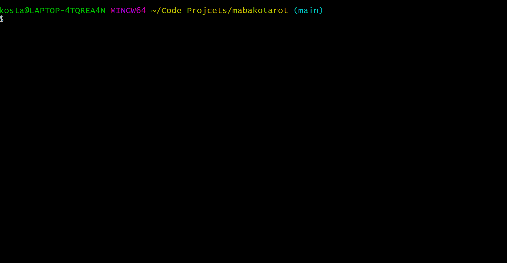

# Ma Bakotarot - Scraper Repository

An app which is an archive of news headlines.

Ma Bakotarot is a project for comparing news headlines from Israel's leading news sites! The scraper is a nodejs lambda container function runnig on a cron schedule 24/7 collecting headlines from news sites using puppeteer.

# The Scraper

See a full demo of running the scraper(splitting to 2 sites each time):

